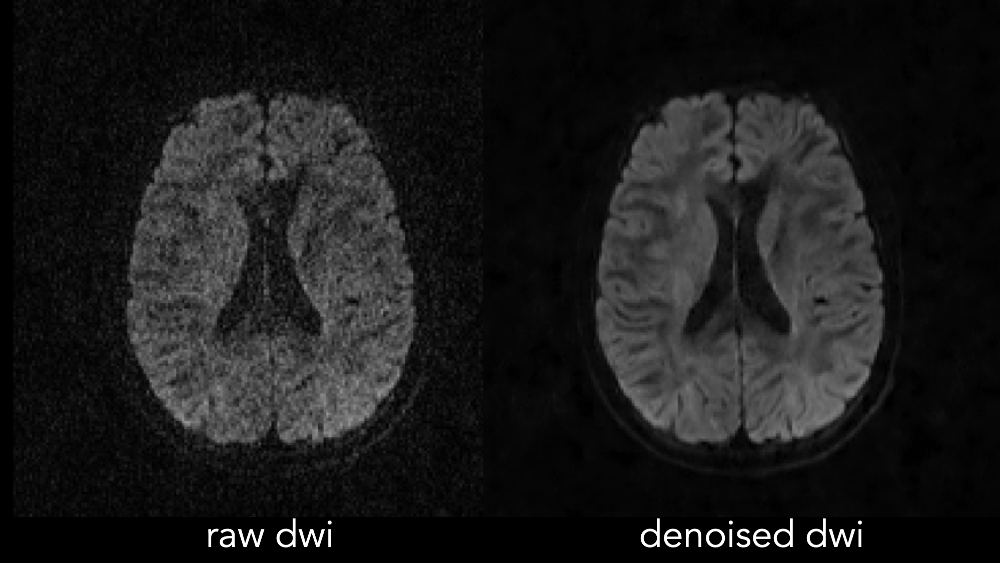
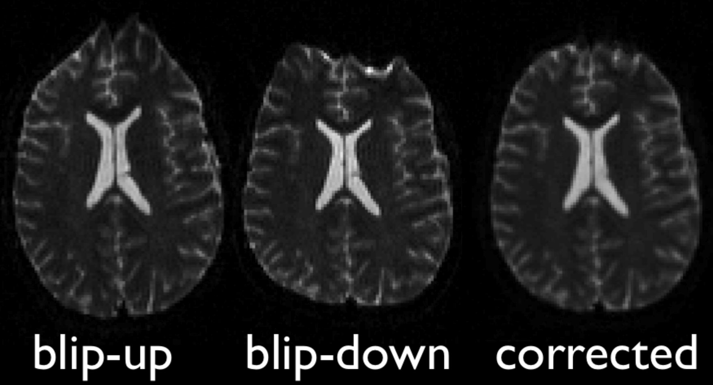

# Preprocessing
#### Table of Contents
- [Dicom Conversion](#dicom-conversion)
- [Denoising](#denoising)
- [Gibbs ringing artifact correction](#gibbs-ringing-artifact-correction)
- [Correct for Eddy Current distortions and movement](#correct-for-eddy-current-distortions-and-movement)
    + [Low number of directions](#low-number-of-directions)
    + [Only one phase-encoding direction](#only-one-phase-encoding-direction)
    + [Two opposite phase encoding directions](#two-opposite-phase-encoding-directions)
    + [HARDI or multi-shell data](#hardi-or-multi-shell-data)
- [Create a mask for your data](#create-a-mask-for-your-data)
- [Bias field correction](#bias-field-correction)

By preprocessing, we are referring to converting your images from the raw DICOM to FA images for each subject and quality controlling along the way to remove scans with abnormalities and artifacts.There can be several ways to pre-process your diffusion weighted data in order to maximize the quality and efficiency of your processing.
We will therefore not require a specific protocol to be followed with any particular software, as long as the appropriate steps are performed. This will allow maximal integration with current pipelines and ensure optimal processing per site if available, and allow sites to:

1. Process data efficiently with respect to acquisition parameters (eg., do not spend time on HARDI-specific algorithms if you only have 6/12 directions collected)
2. Take advantage of your scanning protocols
    * if you know you can calculate FA more robustly using one of many alternate methods, go for it!
    * maximize the quality for your scans (denoising/ removing artifacts etc.)
3. Keep things in line with current/future projects, and non ENIGMA-related investigations you are working on.

If you have FA measures maps calculated and registered already, we can work with you to include them into the Pipeline rather than to re-run everything from the start. Therefore, if you have discovered workflows and methods that fit your data well to best improve SNR, this would be ideal.

If you have already processed your data, please email support.enigmaDTI@ini.usc.edu to let us know your processing workflow. Also if you would like to update this page with any particulars for your methods, please let us know and we would be happy to work in additional options.
For those that have yet to process DTI data, various suggestions are outlined here. A basic series of steps are as follows: NOTE: most of this can be done in multiple ways depending on your data. please do not hesitate to contact us for support .

### Dicom Conversion
[dcm2niix](https://github.com/rordenlab/dcm2niix) has proven to be a good tool for this.

During this process you'll want to take note of the following:
* Determine how your DWI set(s) are organized
* How many many acquisitions do you have? Multiple acquisitions can be merged for optimal signal-to-noise ratio.
* How many b0s do you have and where are they with respect to the full series? (Often the b0 image(s) is/are the first volumes in the DWI set)
* If you have multiple b0, were they acquired with the same encoding gradient? If not, slight variations in processing will be needed.

### Denoising
There are several different denoising methods that can be appropriately used for your data. A few of them are listed below. NOTE: *This is the first step that needs to be taken after dicom to nifti conversion.*
Before deciding on which method, you will need to check 

A few of the different denoising methods include:
 * LPCA
    * _"takes into consideration the multicomponent nature of multi-directional DWI datasets such as those employed in diffusion imaging and reduces random noise in multicomponent DWI by locally shrinking less significant Principal Components using an overcomplete approach [[Manjón et al., 2013]](https://journals.plos.org/plosone/article?id=10.1371/journal.pone.0073021)."_
        * download located [here](https://drive.google.com/file/d/0B9aYHyqVxr04aEpobURaZFhNTmM/edit) and filter documentation located [here](https://sites.google.com/site/pierrickcoupe/softwares/denoising-for-medical-imaging/dwi-denoising/dwi-denoising-software)   
        * zero-filled data may benefit from the DiPy implementation of LPCA located [here](https://dipy.org/documentation/1.0.0./reference/dipy.denoise/)
 * AONLM
    * _"designed for spatially varying noise typically presents in parallel imaging, information regarding the local image noise level is used to adjust the amount of denoising strength of the filter [[Manjón et al., 2011]](https://www.hal.inserm.fr/inserm-00454564/en/)."_
        * download located [here](https://drive.google.com/file/d/0B9aYHyqVxr04aEpobURaZFhNTmM/edit) and filter documentation located [here](https://sites.google.com/site/pierrickcoupe/softwares/denoising-for-medical-imaging/dwi-denoising/dwi-denoising-software)    
* MP-PCA
    * _"exploits the intrinsic redundancy in diffusion MRI using universal properties of the eigenspectrum of random covariance matrices, and removes noise-only principal components -- thereby enabling signal-to-noise ratio enhancements [[Veraart et al., 2016]](https://www.ncbi.nlm.nih.gov/pubmed/27523449)."_
        * code located [here](https://github.com/sunenj/MP-PCA-Denoising) and an MRtrix wrapper is also available called [dwidenoise](https://mrtrix.readthedocs.io/en/latest/reference/commands/dwidenoise.html)

_example of raw dwi gradient direction (left) and LPCA denoised dwi gradient direction (right):_
    
>

### Gibbs ringing artifact correction
Gibbs-ringing is an artifact that is often displayed in MRI images as spurious oscillations nearby sharp image gradients at tissue boundaries. This can be corrected using the method of local subvoxel-shifts proposed by [Kellner et al., 2015](https://www.ncbi.nlm.nih.gov/pubmed/26745823).

* You can correct your data using the original code -- [unring](https://bitbucket.org/reisert/unring/src/master/), or MRtrix's wrapper implementation [mrdegibbs](https://mrtrix.readthedocs.io/en/latest/reference/commands/mrdegibbs.html)
  
_Notes:_
  * Should be performed directly after denoising and before any other preprocessing steps
  * This method was developed to work on images acquired with full k-space coverage
    * "...partial Fourier acquisition demonstrates that incomplete k‐space acquisition schemes propagate the artifact in an obscure nonobvious manner, which might lead to a misinterpretation of image features"
    * Therefore it is imperative to check your data. You can find this information regarding partial k-space coverage in the DICOM tuple [(0018,0022)](http://dicomlookup.com/lookup.asp?sw=Tnumber&q=(0018,0022)) 

### Correct for Eddy Current distortions and movement
* Outlined below are tools used for eddy correction
    * eddy_correct
    * fdt_rotate_bvecs
    * [topup](https://fsl.fmrib.ox.ac.uk/fsl/fslwiki/topup)
        * a tool that estimates the susceptibility induced off-resonance field 
        * the [winner](https://www.biorxiv.org/content/10.1101/766139v2.abstract?%3Fcollection=) in a comparison against 6 other methods 
    * [applytopup](https://fsl.fmrib.ox.ac.uk/fsl/fslwiki/topup/ApplyTopupUsersGuide)
    * [eddy](https://fsl.fmrib.ox.ac.uk/fsl/fslwiki/eddy/UsersGuide)
        * a worthwhile tool that allows you to correct for current-induced distortions and subject movement.
        * generally, this tool can work on most datasets although it is beneficial for any one or combination of the following:
            1.    diffusion encoding gradients that span the entire sphere
            2.    two phase encoding directions (blip-up/blip-down)
            3.    higher b-value data
        * additional features include slice-to-volume movement correction and susceptibility-by-movement interactions with eddy correction    
    * [ENIGMA-DTI EPI Correction](https://git.ini.usc.edu/ehaddad/02_enigma-dti-epi-correction)
        * a registration based technique that uses the non-deformed T1 image as a guide for registration 

_example of opposite phase encoding images that have been corrected:_
>

* It can sometimes be confusing what tools to use for the data you have so we've outlined which preprocessing steps to take based on your data (you may have to use a combination of these steps if your data meets more than one qualification):
    

    #### Low number of directions 
    - (< 10-15 directions for b=1500 and < ~30-40 directions for b=5000)
    - *eddy_correct, fdt_rotate_bvecs*
    #### Only one phase-encoding direction
    - *eddy/(eddy_correct +fdt_rotate_bvecs), ENIGMA-DTI EPI Correction*
    - generate a synthetic opposite phase encoding b0 using [*Synb0-DISCO*](https://github.com/MASILab/Synb0-DISCO), *topup, eddy*
    #### Two opposite phase encoding directions
    - *topup, eddy*

### 
* Additionally, MRtrix has a wrapper script where you specify the encoding scheme with flags. This is useful if you want to save time in creating associated text files for eddy. It is called [dwipreproc](https://mrtrix.readthedocs.io/en/latest/reference/scripts/dwipreproc.html)

### Create a mask for your data
* FSL’s bet2 offers a solution that is quite robust for many datasets.
* Additionally, MRtrix's [dwi2mask](https://mrtrix.readthedocs.io/en/latest/reference/commands/dwi2mask.html) command utilizes directional information to generate a mask that may offer a better option for your data
* [HD-BET](https://onlinelibrary.wiley.com/doi/full/10.1002/hbm.24750), an ANN based algorithm. Code located [here](https://github.com/MIC-DKFZ/HD-BET)

### Bias field correction
Often times, data is affected by B1 field inhomogeneity resulting in signal intensity differences throughout the image. A DWI series can be corrected for this using:
* [ANTs](https://www.ncbi.nlm.nih.gov/pubmed/?term=%22N4%22+AND+%22Tustison+N4ITK%22) or [FSL FAST](https://fsl.fmrib.ox.ac.uk/fsl/fslwiki/FAST)
* There is also a DWI wrapper for these two options using MRtrix called [dwibiascorrect](https://mrtrix.readthedocs.io/en/latest/reference/scripts/dwibiascorrect.html)

_Note:_ You may find it helpful to follow an iterative process where correctly for bias field first and using that as an input, may provide a better mask where bias field correction can be performed again 

