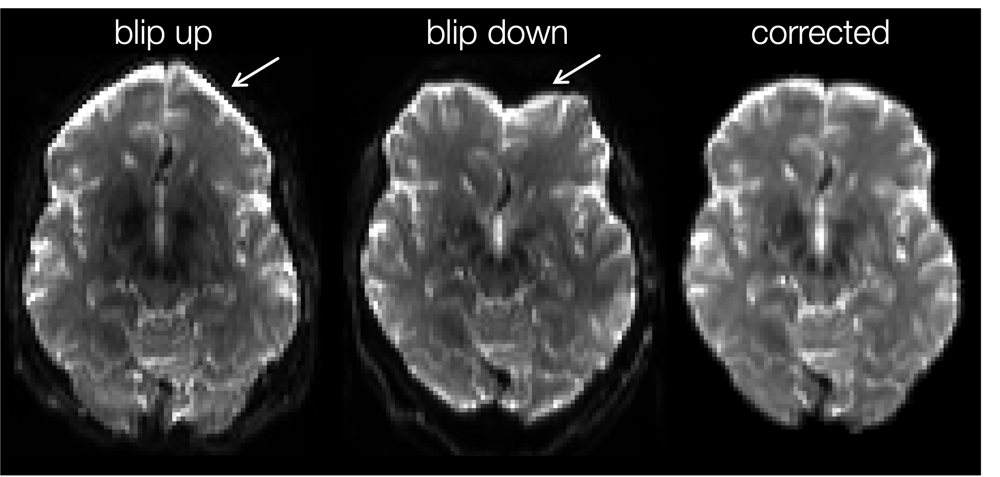

# eDTI Preprocessing
#### Table of Contents
- [Dicom conversion](#dicom-conversion)
- [Denoising](#denoising)
- [Gibbs ringing correction](#gibbs-ringing-correction)
- [Correct for distortions: EPI susceptibility](#correct-for-distortions-epi-susceptibility)
- [Create a mask for your dmri data](#create-a-mask-for-your-dmri-data)
- [Eddy current correction](#eddy-current-correction)
- [Bias field correction](#bias-field-correction)
- [Packages](#packages)

There can be several ways to pre-process your diffusion weighted MRI (dMRI) data in order to remove sources of noise and artifacts before model fitting. Different tools will work best for different datasets, we therefore do not require a specific protocol be followed with any particular software. However, we have outlined recommendations below. If you have discovered workflows and methods that fit your data well to best improve SNR, this is also okay.

If you have already processed your data, please email support.enigmaDTI@ini.usc.edu to let us know your processing workflow. Also if you would like to update this page with any particulars for your methods, please let us know and we would be happy to work in additional options. 

Some notes to consider before following the guidelines below:
1. Some tools identified as wrappers below may require you to download and install a number of different packages (e.g., FSL, ANTs).
2. Look at your data. Most tools have adjustable parameters that can be tuned to your specific dataset. Defaults will not always work.
3. Please do not hesitate to contact us for support at support.enigmaDTI@ini.usc.edu

Outlined below are some basic preprocessing steps and tools presented in the recommended order of use. At the end you will find existing packages that run through most/all preprocessing steps. 

## Dicom conversion
**[`dcm2niix`](https://github.com/rordenlab/dcm2niix)** has proven to be a good tool for this (note, if you’re using an older version of this tool, where outputting a .json file, or BIDS sidecar (`-b`), is not the default, be sure to specify the `-b y` flag).

During this process you'll want to take note of the following:
* Determine how your dMRI set(s) are organized
* How many acquisitions do you have? Multiple acquisitions can be merged for optimal signal-to-noise ratio.
* If you have multiple b0 and/or diffusion weighted images (DWI) with opposite phase encoding directions, do not merge them. They will be used for the estimation of the EPI-induced susceptibility distortion field.
* How many b0s do you have and where are they with respect to the full series (often the b0 image(s) is/are the first volumes in the dMRI set)?
* How many b-values do you have (i.e. single shell or multi-shell)?
* If you have only b-values below 500s/mm² or above 1500s/mm², make sure to note this to your working group as fitting the DTI model may not be appropriate and/or should not be pooled. 

**QC Check:**
* Make sure you have 3 files: data, bvecs, bvals (and ideally a .json file)
* Check orientation of images ([`fslreorient2std`](https://fsl.fmrib.ox.ac.uk/fsl/docs/#/utilities/fslutils?id=fslreorient2std) may be used to reorient flipped or upside down images)
* You may choose to use tools like FSL’s `slicesdir` to make slice wise PNGs to QC. 

## Denoising
There are several different denoising methods that can be appropriately used for your data. A few of them are listed below. 

> [!IMPORTANT] 
> ***This is the first step that needs to be taken after dicom to nifti conversion.*** Before deciding on which method, you will need to check whether the dimensions of your data match the original acquisition or have been k-space zero-filled by the scanner (this is common in GE acquisitions).

A few of the different denoising methods in order of recommendation include:
* **MP-PCA**
    * _"exploits the intrinsic redundancy in diffusion MRI using universal properties of the eigenspectrum of random covariance matrices, and removes noise-only principal components -- thereby enabling signal-to-noise ratio enhancements."_ [(Veraart et al., 2016)](https://www.ncbi.nlm.nih.gov/pubmed/27523449)
        * [DiPy](https://docs.dipy.org/stable/examples_built/preprocessing/denoise_mppca.html) works on zero-filled data and parameters can be manipulated. We recommend starting with a patch size (`patch_radius`) of 3.
        * code located [here](https://github.com/sunenj/MP-PCA-Denoising) and an MRtrix wrapper is also available called [`dwidenoise`](https://mrtrix.readthedocs.io/en/latest/reference/commands/dwidenoise.html) *(**note:** MRtrix wrapper will not work on zero-padded data and hard coded parameters tend to underestimate noise levels.)*

 * **LPCA**
    * _"takes into consideration the multicomponent nature of multi-directional DWI datasets such as those employed in diffusion imaging and reduces random noise in multicomponent DWI by locally shrinking less significant Principal Components using an overcomplete approach."_ [(Manjón et al., 2013)](https://journals.plos.org/plosone/article?id=10.1371/journal.pone.0073021)
        * [DiPy](https://docs.dipy.org/stable/examples_built/preprocessing/denoise_localpca.html) works on zero-filled data and parameters can be manipulated. We recommend starting with a patch size (`patch_radius`) of 3.
        * Original matlab implementation is located [here](https://drive.google.com/file/d/0B9aYHyqVxr04aEpobURaZFhNTmM/edit) but parameters cannot be adjusted and doesn’t work on zero-filled data.

 * **AONLM**
    * _"designed for spatially varying noise typically presents in parallel imaging, information regarding the local image noise level is used to adjust the amount of denoising strength of the filter."_ [(Manjón et al., 2011)](https://www.hal.inserm.fr/inserm-00454564/en/)
        * download located [here](https://drive.google.com/file/d/0B9aYHyqVxr04aEpobURaZFhNTmM/edit) and filter documentation located [here](https://sites.google.com/site/pierrickcoupe/softwares/denoising/dwi-denoising/dwi-denoising-software) *(**note:** only recommended in cases where PCA methods have failed)*
  

            |   |Language | Works on zero- padded data? | Notes | Reference/link
            | ------ | ------ | :------: | ------ | ------ |
            | DiPy | CLI, python | :heavy_check_mark: | can tune | [`mppca`](https://docs.dipy.org/stable/examples_built/preprocessing/denoise_mppca.html); [`localpca`](https://docs.dipy.org/stable/examples_built/preprocessing/denoise_localpca.html)
            | MRtrix | CLI | **X** | parameters are hard coded | [`dwidenoise`](https://mrtrix.readthedocs.io/en/latest/reference/commands/dwidenoise.html)

**QC Check:**
* In image viewer of choice, visualize residuals and make sure they do not resemble anatomy – see picture below
* You may choose to use tools like FSL’s `slicesdir` to make slice wise PNGs to QC. 

## Gibbs ringing correction
Gibbs-ringing is an artifact that is often displayed in MRI images as spurious oscillations nearby sharp image gradients at tissue boundaries. This can be corrected using the method of local subvoxel-shifts proposed by [Kellner et al., 2015](https://www.ncbi.nlm.nih.gov/pubmed/26745823).

* You can correct your data using the original code -- [`unring`](https://bitbucket.org/reisert/unring/src/master/), or MRtrix's wrapper [`mrdegibbs`](https://mrtrix.readthedocs.io/en/latest/reference/commands/mrdegibbs.html), or DiPy's wrapper [`dipy_gibbs_ringing`](https://docs.dipy.org/stable/interfaces/gibbs_unringing_flow.html)
  
_Notes:_
  * Should be performed directly after denoising and before any other preprocessing steps
  * This method was developed to work on images acquired with full k-space coverage
    * _"...partial Fourier acquisition demonstrates that incomplete k‐space acquisition schemes propagate the artifact in an obscure nonobvious manner, which might lead to a misinterpretation of image features"_
    * Therefore, you may want to check your data. You can find this information regarding partial k-space coverage in the DICOM tuple [(0018,0022)](http://dicomlookup.com/dicomtags/(0018,0022)) 

**QC Check:**
* In image viewer of choice, visualize residuals and make sure they resemble high-contrast tissue interfaces where gibbs ringing is more prevalent, e.g., gray matter/csf, white matter/ventricles (see image below)
* You may choose to use tools like FSL’s `slicesdir` to make slice wise PNGs to QC. 

## Correct for distortions: EPI susceptibility
There are a few tools available when data _**have been**_ acquired with opposite phase encoding (ex: AP/PA, LR/RL – see image below):

* **FSL's [`topup`](https://fsl.fmrib.ox.ac.uk/fsl/docs/#/diffusion/topup/index)** – We recommend starting here first
    * How you find the acquisition parameters required for the `--datain` flag of `topup` will vary based on scanner manufacturer but may be found in the .json or the scanner protocol PDF.
    * Helpful hint for identifying scan parameter inputs: MRtrix’s `mrconvert -​​export_pe_eddy` command can automatically generate two text files required for eddy in the next step: _acqp.txt_ & _index.txt_. The parameters in the _acqp.txt_ can be used to build the input for topup’s `--datain`.
    * Note: MRtrix's wrapper – [`dwifslpreproc`](https://mrtrix.readthedocs.io/en/dev/reference/commands/dwifslpreproc.html) runs both topup and the following eddy step. The wrapper automatically generates required text files for both these steps.
    * `applytopup`. topup outputs are fed into `eddy` (next step). However, in cases where eddy cannot be used, you may wish to use `applytopup` to correct EPI distortion before moving on to eddy correction
* **TORTOISE's [`DR-BUDDI`](https://tortoise.nibib.nih.gov/tortoise/v313/10-step-31-after-diffprepdr-buddi)**
* **SPM's [`HySCO`](http://www.diffusiontools.com/documentation/hysco.html)**

If your data _**has not been**_ acquired with opposite phase encoding data, there are 2 options:
* **[`Synb0-DISCO`](https://github.com/MASILab/Synb0-DISCO)** generates a synthetic undistorted b0 from the distorted b0 and a T1w image
    * we recommend preprocessing and masking the T1w image before using this tool
* As a last resort, distorted B0s can also be warped to undistorted anatomical T1w or T2w images using tools like ANTs. See instructions [here](last_resort_epi_corr).
  
**QC Check:**
* Overlay original distorted b0 on corrected undistorted b0 to ensure major differences between images only occur at regions with high distortion 
* You may choose to use tools like FSL’s `slicesdir` to make slice wise PNGs in which the corrected b0 outline is overlaid on the distorted b0 and/or visualize the distortion field generated from the `--fout` flag. The highest values on the fieldmap should represent regions where there is the most distortion, i.e., inferior frontal and inferior temporal regions (example below).

## Create a mask for your dmri data
Masking will be most successful if run on the undistorted b0 (i.e., output from topup). If multiple b0s exist, we recommend taking the mean.
* **FSL’s [`bet`](https://fsl.fmrib.ox.ac.uk/fsl/docs/#/structural/bet?id=bet-brain-extraction-tool)** offers a solution that is quite robust for many datasets.
* MRtrix's developmental version of [`dwi2mask`](https://mrtrix.readthedocs.io/en/dev/reference/commands/dwi2mask.html) is a wrapper for many existing masking algorithms (including the legacy version of dwi2mask that is available in the stable release). One may choose to run any one of these algorithms, but a consensus across algorithms can also be generated (`dwi2mask consensus`). This will require the installation of each respective package. See tools on help page.

**QC Check:**
* Overlay mask on unmasked b0 to make sure there are no major over/under estimations
* We offer a script [here](scripts/qc_image_generation.py) in this repository that generates PNGs with a transparent mask overlaid on the anatomical image (examples below).

## Eddy current correction
Once you have estimated the susceptibility distortion field with topup (using opposite phase encoding maps or Synb0), you can use these fields as an input into FSL’s [`eddy`](https://fsl.fmrib.ox.ac.uk/fsl/docs/#/diffusion/eddy/users_guide/index?id=user39s-guide-for-eddy), which will simultaneously correct for eddy currents and susceptibility distortions across volumes. Note: FSL eddy is only recommended for data acquired on full sphere dMRI acquisitions with greater than 15 directions (>10-15 directions for b=1500 and >~30-40 directions for b=5000); regardless, you should still try!

Helpful tools:
* How you find the acquisition parameters required for eddy will vary based on scanner manufacturer but may be found in the .json or the scanner protocol PDF. More information can be found [here](https://fsl.fmrib.ox.ac.uk/fsl/docs/#/diffusion/topup/FAQ/index?id=how-do-i-know-what-to-put-into-my-acqp-datain-text-file).
* MRtrix’s [`mrconvert -​​export_pe_eddy`](https://mrtrix.readthedocs.io/en/latest/reference/commands/mrconvert.html) command can automatically generate two text files required for eddy: acqp.txt & index.txt. 
* **Note:** MRtrix's wrapper – [`dwifslpreproc`](https://mrtrix.readthedocs.io/en/dev/reference/commands/dwifslpreproc.html) runs both topup and eddy. The wrapper automatically generates required text files for both these steps.

While there are many options, here are some FSL's [`eddy`](https://fsl.fmrib.ox.ac.uk/fsl/docs/#/diffusion/eddy/users_guide/index?id=user39s-guide-for-eddy) flags we recommend including:
* `--repol`: Use this flag to detect slice outliers across volumes and correct via interpolation. This is very useful in cases of a lot of movement. There are additional options for slice outlier detections, i.e. `--ol_*` – please refer to the [FSL documentation](https://fsl.fmrib.ox.ac.uk/fsl/docs/#/diffusion/eddy/users_guide/index?id=parameters-pertaining-to-outlier-replacement) for more information.
* `--slspec`: If you have access to a GPU, you can run `eddy_cuda` with slice to volume correction, especially in cases where the dmri has been acquired with multislice/multiband. There are two different options for specifying how slices were acquired. For newer versions of FSL, you can provide the `.json` file using the `--json` flag, or for older versions you can create the slspec file needed for the `--slspec` flag using the following MATLAB [script](scripts/create_eddy_slspec.m), although the former is recommeneded to help avoid mistakes. 

In cases where FSL eddy fails (e.g. half sphere acquisitions, too few gradient directions, and/or cartesian grid acquisitions), you can try TORTOISE’s [`DIFFPREP`](https://tortoise.nibib.nih.gov/tortoise/v313) & [`DR-BUDDI`](https://tortoise.nibib.nih.gov/tortoise/v313). Note: In cases where `DR-BUDDI` was not run for EPI correction (i.e. topup was used), `DIFFPREP` will not automatically correct for EPI distortions. We recommend using FSL `applytopup` on the outputs of `DIFFPREP`.

**QC Check:**
* In addition to visualizing generated outputs, looking at the [output and log files](https://fsl.fmrib.ox.ac.uk/fsl/docs/#/diffusion/eddyqc) may be useful.

## Bias field correction
Often times, data is affected by B1 field inhomogeneity resulting in signal intensity differences throughout the image. A DWI series can be corrected for this using:
* **ANTs[`N4BiasFieldCorrection`](https://github.com/ANTsX/ANTs/wiki/N4BiasFieldCorrection)** or **FSL's [`fast`](https://fsl.fmrib.ox.ac.uk/fsl/fslwiki/FAST)**
* Using **MRtrix’s [`dwibiascorrect`](https://mrtrix.readthedocs.io/en/latest/reference/commands/dwibiascorrect.html)** wrapper, you can select your algorithm of choice
 

## Packages

* [`qsiprep`](https://qsiprep.readthedocs.io/en/latest/index.html)
* [`designer`](https://github.com/NYU-DiffusionMRI/DESIGNER)
* [PreQual](https://github.com/MASILab/PreQual)
* [ENIGMA CHR DTI pipeline](https://github.com/kcho/ENIGMA_CHR_DTI/) (note: also  goes through enigma tbss pipeline)
* dmriprep (coming soon)

